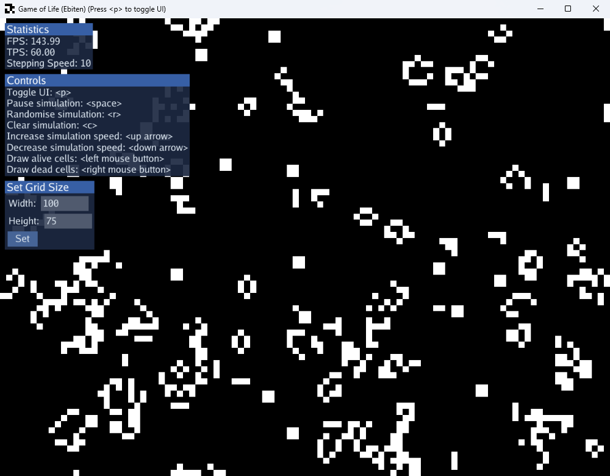

# Game of Life (Ebiten)

A simple implementation of [Conway's Game of Life](https://en.wikipedia.org/wiki/Conway%27s_Game_of_Life) in Go using [Ebiten](https://ebitengine.org/) and [Ebiten UI](https://ebitenui.github.io/).

The game creates a grid of cells that are randomly initialised to either **Alive** or **Dead**. It then steps through subsequent generations where a cell's state is determined by simple rules:

1. If an **Alive** cell has fewer than 2 or more than 3 living neighbours it becomes **Dead**
2. If a **Dead** cell has exactly 3 living neighbours it becomes **Alive**
3. If an **Alive** cell has 2 or 3 living neighbours it continues living in the next generation

An online hosted build of this game is available [here](https://odddollar.github.io/Game-of-Life-Ebiten/).

## Features

- Graphical display of simulation state
- Changing simulation speed
- Drawing cells as either **Alive** or **Dead** with the mouse
- Resizable simulation grid
- Movable and toggleable UI windows

## Building

The following commands can be used to build the program with icons for Windows:

```bat
go install github.com/tc-hib/go-winres@latest
go-winres simply --icon assets/icon.png
go build -ldflags "-s -w -H=windowsgui" -o "Game of Life.exe"
del *.syso
```

Optionally compress the executable with [UPX](https://upx.github.io/):

```bat
upx --best --ultra-brute "Game of Life.exe"
```

## Example



